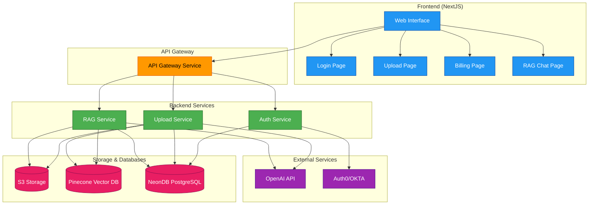
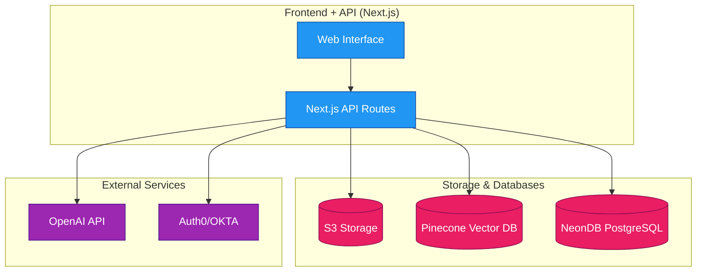

# lets build enterprise RAG Application from scratch in 6 hrs

You will need the following tools:

- Cursor - you will use this to write the code
- FASTAPI - you will use this to build the API
- NEXTJS - you will use this to build the UI [ tailwindcss, shadcn/ui , serverless ]
- github actions - you will use this to deploy the application
- PINECONE - you will use this to store the vector embeddings
- OPENAI - you will use this to generate the embeddings
- Langchain/ LlamaIndex - you will use this to build the data extraction pipeline
- S3 for file storage
- Neondb for our postgres database

# Planning stage:

### Features that busines users want:

- Upload documents
- Chat with documents / AI
- Billing
- Streaming of the Responses
- Sclaability in terms of adding new features to the application without bloat or re-writing the entire application

### Additional requirements:

- Observanility amd Monitoring [ just to do site monitoring iwth ease as well as for LLMops - langfuse and others ]
- Gaurd Rails [ corretcess + Not have PII( personal identifiable information) ]
- Security [ prevent data from being leaked/ access to the data ]

### ITs not just the LLM its but everything that wraps around the LLM and the user.

We will start with Business Goals for most Enterprise RAG applications.

## What will the end user of the enterprise RAG application be able to see and do?

- Login page ( with working login credentials ) [ we cna use mannual login credentials for now, or can use OKTA or Auth0 ]
- Upload page ( which will hold the uplaod pipeline inclduing emebedding and status of the upload )
- Billing page ( which will hold the billing information and the billing history )
- Main RAG chat application page ( which will hold the RAG application and the RAG Chat history )

## Backend Architecture:

- FastAPI - for the API - with microservices architecture / basically with gateways
- Github Actions - for the deployment
- Pinecone - for the vector embeddings
- OpenAI - for the embeddings
- Langchain/ LlamaIndex - for the data extraction pipeline
- S3 for file storage
- Neondb for our postgres database

Because LLMS are so new and imperfect their business use cases are being changed and redefined every couples of week/ month.
THis is why the app needs to be scalable and super suepr flexible to add new features and new use cases on the fly.

## in FastAPI we will have 3 main services:

- Auth service
- Upload service
- RAG service
- Gateway service

We may use CursorRules file as well to help us write the code.

- backend
- front end

BUild out a Architecture Diagram for the application.

A few more things to note:

Lets just start with the basic features and then we can add more features as we go along. We will try to simplify things and keep things as serverless as possible for the current bill as we lack the resources to run a server.

## Serverless Architecture:

- Next.js API Routes (Edge Runtime) - replacing FastAPI
- Vercel for deployment (instead of separate GitHub Actions)
- Pinecone - for vector embeddings
- OpenAI - for embeddings
- S3 for file storage
- Neondb for postgres database

### Next.js API Routes will handle:

- Auth service (using NextAuth.js)
- Upload pipeline including:
  - File chunking
  - Embedding generation
  - Vector storage
- RAG service

### Benefits of Serverless Approach:

1. Simplified deployment
2. Lower costs (pay per request)
3. Automatic scaling
4. Reduced maintenance overhead
5. Better development experience (unified codebase)

### Considerations:

- Edge Runtime has a timeout limit (30s on Vercel), so for longer operations we might need to:
  - Implement chunking on the client side
  - Use background jobs for large files
  - Consider using Vercel's Edge Functions for longer-running tasks
